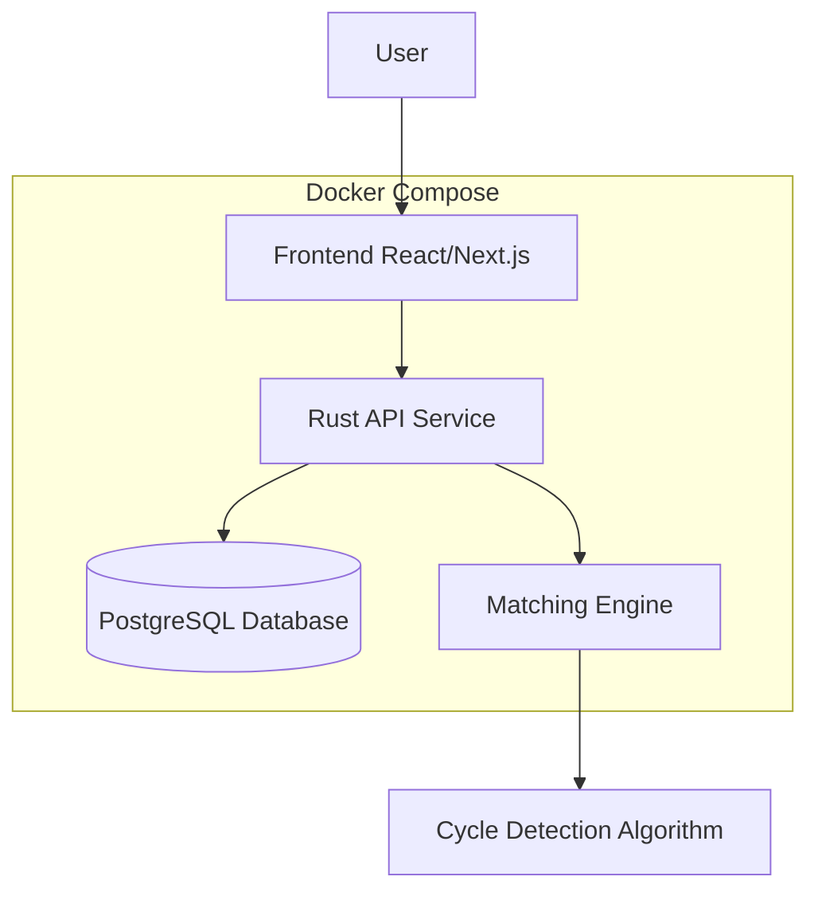

# CircleMatch - Teacher Transfer Matching System

A matching platform designed for Taiwan's teachers, helping them find bilateral, triangular, or multi-node transfer opportunities, making teacher transfers more efficient and convenient.

## Demo
[](https://www.loom.com/share/320e245d4ae4429699ec673a09967d7a)


## System Architecture



## Features

- Google OAuth authentication for secure user login
- Teachers can register personal information, including current school, city/county, and target locations
- Support for multiple teaching positions per user account
- Multi-directional matching algorithm to find bilateral, triangular, or multi-node (cycle) transfer opportunities
- Debug mode for testing and viewing all potential matches
- User-friendly interface with responsive design
- Comprehensive teacher contact information for matched users

## Technologies

- **Frontend**: Next.js, React, TypeScript
- **Backend**: Rust with Axum web framework
- **Database**: PostgreSQL
- **Authentication**: Google OAuth
- **Containerization**: Docker & Docker Compose

## Development Setup

### Requirements

- Node.js 18+
- Rust 1.60+
- Docker & Docker Compose
- PostgreSQL (if running locally without Docker)
- Google OAuth credentials

### Environment Setup

1. Clone the repository
   ```bash
   git clone https://github.com/yourusername/cycle-match.git
   cd cycle-match
   ```

2. Create `.env` file based on `.sample.env`
   ```bash
   cp .sample.env .env
   ```

3. Add your Google OAuth credentials to the `.env` file
   ```
   GOOGLE_CLIENT_ID=your-client-id
   GOOGLE_CLIENT_SECRET=your-client-secret
   ```

### Running with Docker

```bash
# Start all services with Docker Compose
docker compose up -d
```

The application will be available at:
- Frontend: http://localhost:3000
- Backend API: http://localhost:8000

### Running Locally for Development

#### Backend
```bash
cd backend
cargo run
```

#### Frontend
```bash
cd frontend
npm install
npm run dev
```

## API Documentation

- `POST /api/google-login` - Authenticate with Google token
- `POST /api/teachers` - Register/update teacher information
- `GET /api/teachers` - Get list of teachers (optional `google_id` parameter)
- `GET /api/matches` - Find potential matches

## To-Do
- [ ] Enable edition on submitted forms
- [ ] Create production and testing DB
- [ ] Test with Supabase
- [ ] Go production

## License

MIT