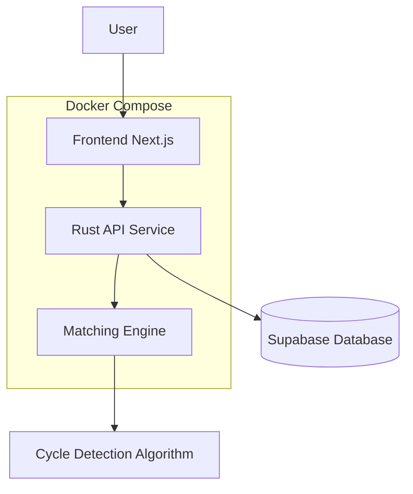

# Cycle Match - Taiwan Teacher Transfer Matching System

A matching platform designed for Taiwan's teachers, helping them find bilateral, triangular, or multi-node transfer opportunities, making teacher transfers more flexible and convenient.

## System Architecture



## Features

- Teachers can register personal information, including teaching credentials, current school, city/county, etc.
- Set preferred schools for transfer with priority ranking
- Automatic matching to find bilateral, triangular, or multi-node transfer opportunities
- Real-time notifications for successful matches

## Development Setup

### Requirements

- Node.js 18+
- Rust 1.60+
- Docker & Docker Compose

### Starting the Development Environment

```bash
# Clone repository
git clone https://github.com/yourusername/cycle-match.git
cd cycle-match

# Start with Docker Compose
docker compose up -d
```

## API Documentation

- `POST /api/teachers` - Register/update teacher information
- `GET /api/teachers` - Get list of teachers
- `GET /api/matches` - Find potential matches
- `GET /api/matches/{id}` - Get details of a specific match

## License

MIT